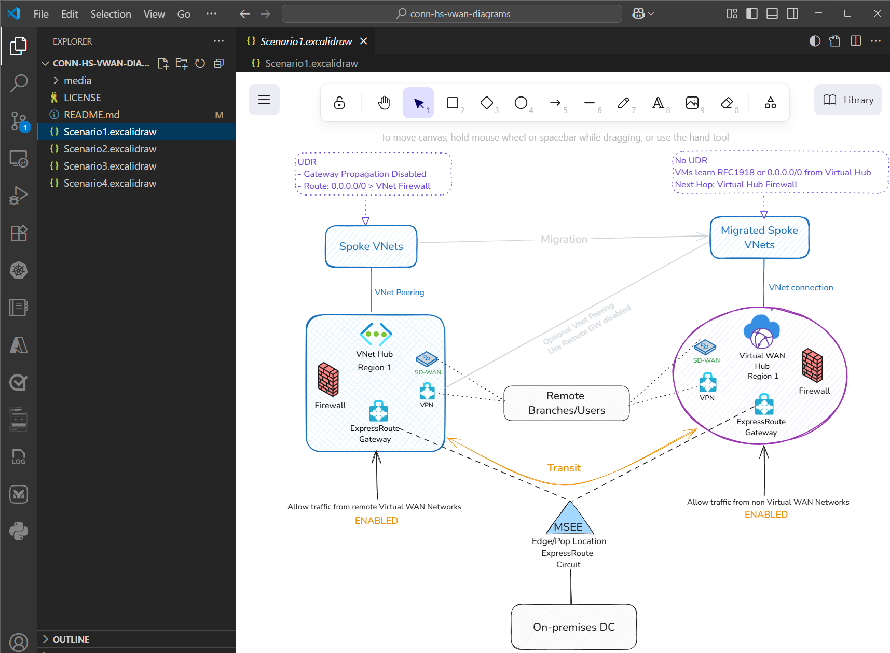

# Network Diagrams for Connectivity options between Hub-and-Spoke and Azure Virtual WAN

## Intro

This repository contains network diagrams that illustrate various connectivity options between Hub-and-Spoke architectures and Azure Virtual WAN, based on the blog post: [Connectivity options between Hub-and-Spoke and Azure Virtual WAN](https://techcommunity.microsoft.com/blog/azurenetworkingblog/connectivity-options-between-hub-and-spoke-and-azure-virtual-wan/4437383).

The diagrams are designed to help visualize different scenarios and configurations for network connectivity in Azure.

There are few options here to consume those diagrams:

1. Download the diagrams directly from the repository in Excalidraw format
2. Fork this repo and open the diagram on Visual Studio Code with the [Excalidraw extension](https://marketplace.visualstudio.com/items?itemName=pomdtr.excalidraw-editor) installed as shown:

3. Open them in the Excalidraw editor for further customization and saving using the links on for each scenario below.

## Scenario 1 – Traffic hair-pinning using ExpressRoute circuits

[Open diagram with Excalidraw](https://excalidraw.com/#url=https://raw.githubusercontent.com/dmauser/conn-hs-vwan-diagrams/refs/heads/main/Scenario1.excalidraw)

## Scenario 2 – Build a virtual tunnel (SD-WAN or IPSec)

[Open diagram with Excalidraw](https://excalidraw.com/#url=https://raw.githubusercontent.com/dmauser/conn-hs-vwan-diagrams/refs/heads/main/Scenario2.excalidraw)

## Scenario 3 – vNet Peering and vHub connection coexistence

[Open diagram with Excalidraw](https://excalidraw.com/#url=https://raw.githubusercontent.com/dmauser/conn-hs-vwan-diagrams/refs/heads/main/Scenario3.excalidraw)

## Scenario 4 – Transit virtual network for decentralized vNets

[Open diagram with Excalidraw](https://excalidraw.com/#url=https://raw.githubusercontent.com/dmauser/conn-hs-vwan-diagrams/refs/heads/main/Scenario4.excalidraw)